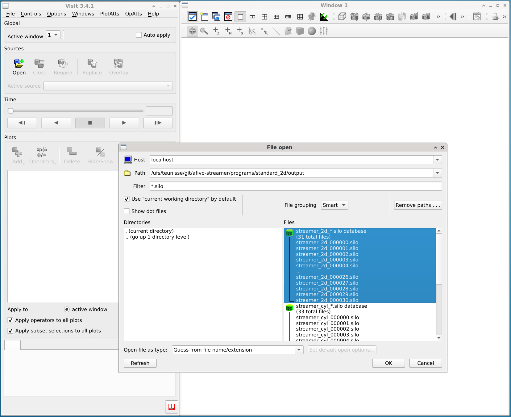
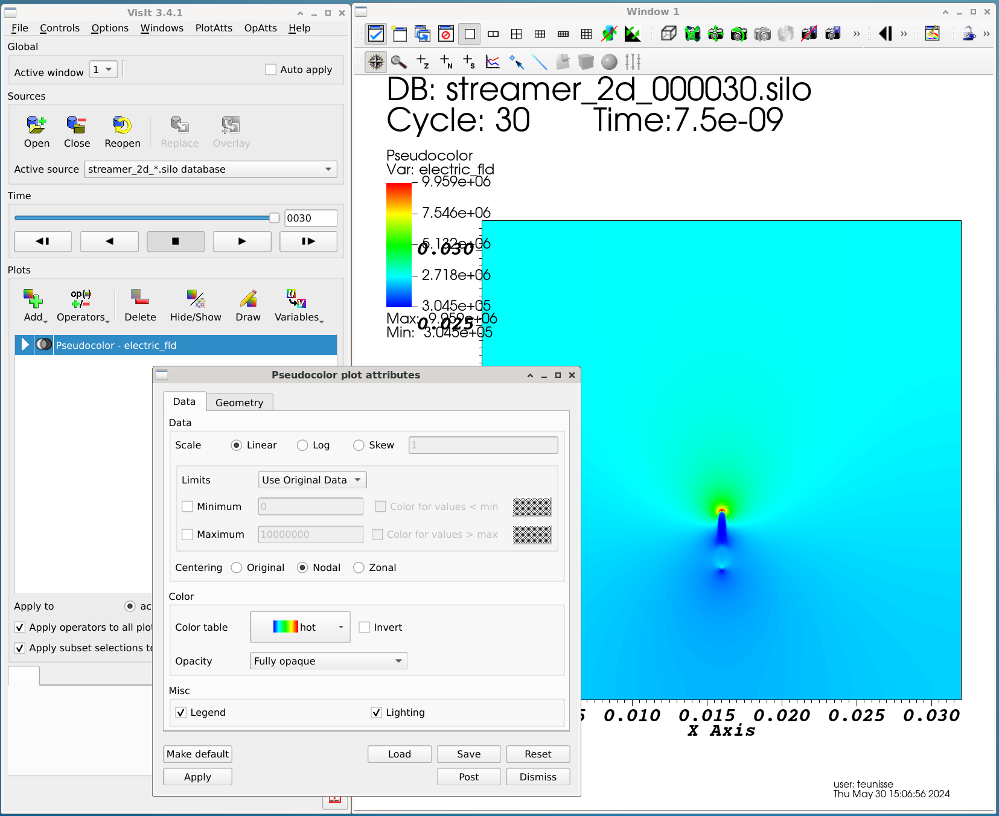
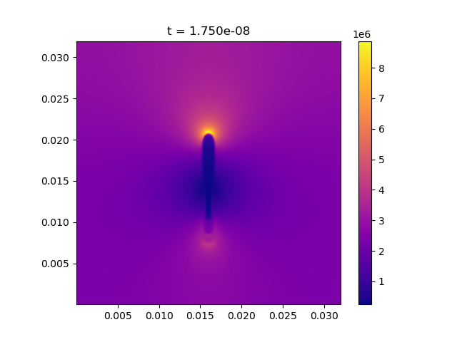

# Saving output and visualization {#saving-output-visualization}

[TOC]

Here, the various ways of visualizing the data generated by the simulations or to obtain certain data from the simulations are explained.

# Parameters that control the saving of output

The code snippet below shows the most important settings for controlling the output:

\snippet m_output.f90 main_output_settings

An example of how to use these parameters in a config file is shown below:

    [output]
        # The timestep for writing output (s):
        dt =  2.0000E-10

        # Name for the output files (e.g. output/my_sim):
        name = 'output/test'

For a full list of parameters that control the output, see the source code of @ref m_output::output_initialize or the [options documentation](documentation/simulation_options.md).

# The typical output of a simulation

Simulations will typically produce at least the following output:

* `<simulation_name>_<number>.silo`: Silo files that can be visualized using e.g. Visit, see @ref visualization-with-visit
* `<simulation_name>_log.txt`: a log file, see @ref #log-files
* `<simulation_name>_out.cfg`: includes all the parameter specified by the user, as well as the other parameters that had their default value, together with brief documentation.
* `<simulation_name>_summary.txt`: contains a table with electron transport data. The ionization and attachment coefficients are computed based on the chemical reactions. They can differ from the coefficients given as input data if there are for example three-body attachment reactions.
1. `<simulation_name>_rates.txt`: Contains volume and time-integrated reaction rates, for each timestep.
2. `<simulation_name>_amounts.txt`: Contains the amount of each species (volume-integrated densities), for each timestep.
3. `<simulation_name>_reactions.txt`: Contains the list of all the reactions used in the simulation
4. `<simulation_name>_species.txt`: Contains the list of all the species used in the simulation
4. `<simulation_name>_stoich_matrix.txt`: This file contains the [stoichiometric matrix](https://en.wikipedia.org/wiki/Stoichiometry#Stoichiometry_matrix) of the reaction set used in the simulation.

Note that there are several Python tools that can be used to visualize or analyze the above`.txt` files, see [Python tools for input, output and analysis](documentation/tools.md). In particular, the chemistry output files can be visualized using the `chemistry_visualize_rates.py` script in the `/tools` directory.

# Viewing results with Visit {#visualization-with-visit}

By default, the simulations produce Silo files (`.silo`) for which the recommended viewer is [Visit](https://visit-dav.github.io/visit-website/). Extensive documentation is available on the website, but a brief summary of basic steps is given below.

## Opening a dataset

Open a simulation data set (a bunch of `.silo` files) using the 'Open' button.

{html: width=80%}

## Names of the variables

Which species are included depends on the chemistry input file, see the [chemistry documention](chemistry.md). Other important variables are:

name | description
--|--
e | Electron density (m^-3)
electric_fld | Electric field strength (V/m)
phi | Electric potential (V)
rhs | Right-hand side of Poisson equation (`-rho/epsilon_0`)
lsf | With an electrode: the level set function, zero at the electrode boundary
photo | With photoionization: the photoionization source term (m^-3 s^-1)
`M_min` | Negative ion species (if no chemistry is defined) (m^-3)
`M_plus` | Positive ion species (if no chemistry is defined) (m^-3)

## Visualizing 2D data

2D data can be visualized using the `Add -> Pseudocolor -> <variable name>` buttons. Afterwards, press the `Draw` button to draw the plot. By double-clicking on the resulting item, the properties of the plot can be adjusted (e.g., the color scale).

{html: width=80%}

## Visualizing 3D data

3D data can be visualized with `Pseudocolor` as well, and afterwards applying for example `Operators -> Slicing -> Slice`. Other options are volume rendering using `Volume` and surface plots using `Contour`.

## Making videos using VisIt

* The following link gives an overview on creating movies in VisIt: [Making movies in VisIt](https://www.visitusers.org/index.php?title=Making_Movies).

* To add/customize the appearance of stuff like legends, titles, time progress bar, go to `Controls -> Annotation` in the VisIt menu.

# Viewing results using Python

Afivo includes a tool to directly visualize `.silo` files using Python, which can be found at `afivo/tools/plot_raw_data.py`. Documentation for this script is available by calling it with a `-h` flag. Some examples of what it can do are:

* Plot and save simulation data on an uniform mesh. This can be useful if you want to process simulation results with other tools.
* Project simulation data along on or more dimensions. Axisymmetric geometries are also supported.
* Perform a forward Abel transform on axisymmetric data.

The script does not support 3D visualization, so 3D data should be projected first. An example of a 2D plot is shown below.

{html: width=50%}

# Log files {#log-files}

Every simulation produces a log file `<output_name>_log.txt`. The log file is a text file containing information about the physics and numerical properties of the simulation. It is possible to write extra variables to the log file by defining the routine `user_log_variables()`, see `m_user_methods`.

Which variables the log file contains depends on the dimensionality of the run. Some relevant variables are:

name | meaning
---|---
`it` | simulation iteration
`time` | simulation time
`dt` | time step
`v` | estimate of streamer velocity (compared to last output)
`sum(n_e)` | integral of electron density
`sum(n_i)` | integral of first positive ion species
`sum(charge)` | integral of charge density (considering all species)
`max(E) x y` | maximum electric field + location
`max(n_e) x y` | maximum electron density + location
`max(E_r) x y` | maximum radial field + location
`voltage` | current applied voltage
`ne_zmin`, `ne_zmax` | Min/max location where the electron density exceeds a threshold
`max(Etip) x y` | Maximum electric field at streamer tip (tries to avoid boundaries) + location
`wc_time` | simulation wall-clock time (how long it has been running)
`n_cells` | number of grid cells used in simulation
`min(dx)` | minimum grid spacing
`highest(lvl)` | highest refinement level

There are several tools that can be used to view log files:

* `tools/plot_log_file.py`: loads a log file and plots the streamer velocity and maximum electric field. The radius is also shown, but only correctly for 2D axisymmetric discharges.
* `tools/plot_log_xy.py`: plot two quantities against from one or more log files.

Documentation for these tools is available by calling them with the `-h` argument.

# Binary output and restarting

Afivo-streamer allows a simulation to be continued at a later time through the use of binary output files (`.dat` files). To do this, the simulation is initially run and set up to write DAT files, which could be achieved by using the following `.cfg` file options:

 * `datfile%%write` - set to true if you want to write DAT files
 * `datfile%%per_outputs` - control when DAT files are written by equating this to an integer (e.g. `datfile%%per_outputs = 20` means that a DAT file is created every after 20 output files are written)

To begin another simulation run from a particular `.dat` file, set the flag `restart_from_file` equal to a string with the name (and location, if in a different directory) of the `.dat` file you want to use as the starting point of the other simulation run.

# List of issues encountered and solutions

* **Waiting message:** While making the videos using the default options, users may encounter a window saying 'VisIt is waiting for a CLI to launch on localhost'. This is due to the missing **xterm** package on the system. It can be installed using `sudo dnf install xterm`(Fedora) or `sudo apt-get install xterm` (Ubuntu).

* **Weird video generated:** The videos generated sometimes have a different color scheme or maybe the frames are inverted/mirrored. This was solved by installing the **ffmpeg** package using `sudo dnf install ffmpeg` (Fedora) or `sudo apt-get install ffmpeg` (Ubuntu).`

* **Bad video quality/Custom videos:** The videos generated by VisIt maybe of bad quality or the user may want to make videos of a particular portion of the simulation domain. Then a set of PNG/JPEG images can be generated using VisIt, which can be suitably modified and made into a video using **ffmpeg** as follows:

    Suppose the set of PNG files are _movie0000.png_ ... _movie0032.png_ and the output video name is _resultVideo.mp4_, then the necessary command is

    ffmpeg -i movie%04d.png resultVideo.mp4
