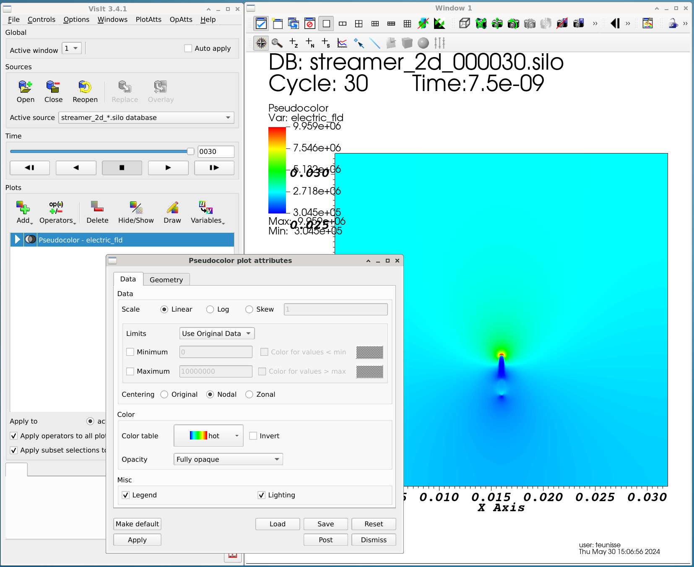

# Tutorials

[TOC]

This page contains tutorials that should help new users get started with the code. Before starting these tutorials, it is helpful to read the following pages:

* [Installation](documentation/installation.md)
* [Config files and command-line arguments](documentation/simulation_options.md)
* [Saving output and visualization](documentation/output_and_visualization.md)
* [Electrodes and boundary conditions](documentation/electrodes_bc.md)
* [Initial conditions](documentation/initial_conditions.md)

# Running built-in examples

To run the standard 2D examples, go to the folder `programs/standard_2d`:

    cd programs/standard_2d

To be sure that the simulation code is compiled, you can compile it with:

    make

An executable `streamer` should be present. You can run it with a configuration
file like this:

    ./streamer streamer_2d.cfg

This example writes its output to a subdirectory `output`. If this directory does not exist, the code will abort with a message

    Output name: output/streamer_2d_...
    ERROR STOP Directory not writable (does it exist?)

After creating the output directory with `mkdir output`, the code should run and print (among other things) the following information:

    af_write_silo: written output/streamer_2d_000001.silo
    af_write_silo: written output/streamer_2d_000002.silo
    af_write_silo: written output/streamer_2d_000003.silo
    ...

These Silo files can be visualized using for example Visit, as explained at [Saving output and visualization](documentation/output_and_visualization.md). An example is included below.

{html: width=80%}

The 2D version of the `streamer` executable can also be used for axisymmetric simulations:

    ./streamer streamer_cyl.cfg

There are also 1D and 3D examples, which can be found in

    programs/standard_1d
    programs/standard_3d (note that this example takes a long time!)

# Simple config file for an axisymmetric streamer in air  {#tutorial-air-simple}

Here we will briefly show how to construct a simple config file, leaving most parameters to their default values. An axisymmetric positive streamer will be simulated in air. Below, it is assumed that a file `tutorial_air_simple.cfg` is created in the `programds/standard_2d` folder. The following settings should then be specified in the config file.

## The computational domain

This defines axisymmetric domain measuring 20 mm in the r and z directions:

    # Whether cylindrical coordinates are used (only in 2D):
    cylindrical = T

    # The length of the domain (m):
    domain_len = 20e-3 20e-3

## The simulation name, output time step and end time

Output files with start with `output%%name`. In this case, output will be written every 0.5 ns, and the simulation will run until 10 ns:

    # Name for the output files (e.g. output/my_sim):
    output%name = output/tutorial_air_simple

    # The timestep for writing output (s):
    output%dt = 0.5e-9

    # The desired endtime (s) of the simulation:
    end_time = 10e-9

## The gas

The simulations will be performed in artificial air (80% N2, 20% O2) at 1 bar and 300 K (which are actually the default values):

    # The gas pressure (bar):
    gas%pressure = 1.0

    # Gas component names:
    gas%components = N2 O2

    # Gas component fractions:
    gas%fractions = 0.8 0.2

    # The gas temperature (Kelvin):
    gas%temperature = 300.0

## The electron transport data and reactions to use

There are several transport data and reaction files included with the code, in the `transport_data` folder. In this case, we will use a simple air chemistry:

    # Input file with transport (and reaction) data:
    input_data%file = ../../transport_data/air_light_example_v0.txt

Note that the path should point to the `afivo_streamer/transport_data` directory.

## The background electric field

In this example, the background electric field will be 2.0 MV/m, which is about half of the critical field of air at 300 K and 1 bar:

    # How the electric field or voltage is specified:
    field_given_by = field 2.0e6

For other ways of specifying the background field or the applied voltage, see [Electrodes and boundary conditions](documentation/electrodes_bc.md).

## The initial conditions

The formation of a streamer requires:

* A region wherhe the electric field exceeds the critical field
* Some initial electrons

In this example, the background field is below the critical field. To enhance the background field, we will place an elongated conducting channel in the domain (a "seed"), see [Initial conditions](documentation/initial_conditions.md). This seed will have an electron density and positive ion density of `5e19 / m3`, and will be 2 mm long and 0.25 mm wide. Furthermore, we will a so-called "smoothstep" profile (see @ref m_geometry). After some time, the electric field in the seed will be partially screened (i.e., have a lower value), which will enhance the electric field at the endpoints of the seed.

    # Type of seed: neutral (0), ions (1) or electrons (-1)
    seed_charge_type = 0

    # Initial density of the seed (1/m3):
    seed_density = 5e19

    # The relative start position of the initial seed:
    seed_rel_r0 = 0.0 0.45

    # The relative end position of the initial seed:
    seed_rel_r1 = 0.0 0.55

    # Seed width:
    seed_width = 0.25e-3

    # Fallof type for seed, see m_geom.f90:
    seed_falloff = smoothstep

Finally, a small background ionization level of `10^10/m3` electrons and positive ions is included. Such background ionization can help to start the discharge.

    # The background ion and electron density (1/m3):
    background_density = 1e11

## Photoionization

In air, photoionization is an important process, especially for positive streamer discharges. Here we simply use the default Helmholtz photoionization model, see [Photoionization](documentation/photoionization.md) for more details.

    # Whether photoionization is enabled:
    photoi%enabled = T

    # Which photoionization method to use (helmholtz, montecarlo):
    photoi%method = helmholtz

## Running the example and analyzing the output

After putting all the above parameters in a file `tutorial_air_simple.cfg`, the simulation can be performed using the command:

    ./streamer tutorial_air_simple.cfg

# Changing the gas and the chemistry

To use a different gas requires the following steps:

1. If no suitable transport data file is already avaible, electron-neutral cross sections for the gas have to be obtained and electron transport data has to be computed, see [Generating electron transport data](documentation/transport_data.md)
2. Depending on the application, additional chemical reactions have to be obtained.
3. If applicable, photoionization parameters for the gas have to be obtained. Unfortunately, there is often a lack of information on these parameters.
4. Updating the config file

Below, we will provide a basic outline of these steps for a somewhat simplified case of simulations in pure argon, without any additional chemistry.

## Cross sections and transport data

We will skip a detailed explanation here, since this step is covered at @ref td-boltzmann. Here it is assumed that the Linux version of `Bolsig+` is used, which is called `bolsigminus`, but the same can be achieved with the Windows or online version. Coupled with the program is a set of Siglo cross sections, which are also available from [lxcat](https://lxcat.net). We will use the input file provided at `documentation/tutorial_files/bolsigminus_argon_input.txt`

After executing bolsigminus, a file called `argon_swarm.dat` is produced, which is also provided at `documentation/tutorial_files/argon_swarm.txt`. This file can be converted using `tools/bolsig_convert.py`:

    tools/bolsig_convert.py <path>/argon_swarm.dat <path>/argon_transport_data.txt

which produces a file `argon_transport_data.txt` that is also listed under `documentation/tutorial_files`. We will now add a minimal chemistry to this file, which will only consist of an ionization reaction:

    reaction_list
    -----------------------
    # Only a single ionization reaction
    e + Ar -> e + e + Ar+,field_table,C3 Ar Ionization 15.80 eV
    -----------------------

The resulting file is available at `documentation/tutorial_files/argon_chemistry.txt`.

## Updating the config file

Note that we will not include photoionization here, so that the following parameters should be changed:

    # Whether photoionization is enabled:
    photoi%enabled = F

    # Gas component names:
    gas%components = Ar

    # Gas component fractions:
    gas%fractions = 1.0

    # Input file with transport (and reaction) data:
    input_data%file = <path>/argon_chemistry.txt

An example of config file for axisymmetric simulations is available at `documentation/tutorial_files/tutorial_argon.cfg`.

# Including a rod electrode

# Determining the energy efficiency of species production

# Chaning photoionization parameters in air {#changing-photoionization}

# Running simulations from a different folder

# Adjusting grid refinement and testing convergence

# Changing boundary conditions

# Specifying a non-uniform gas number density

TODO

# Including gas dynamics

TODO

# Including a dielectric

TODO
